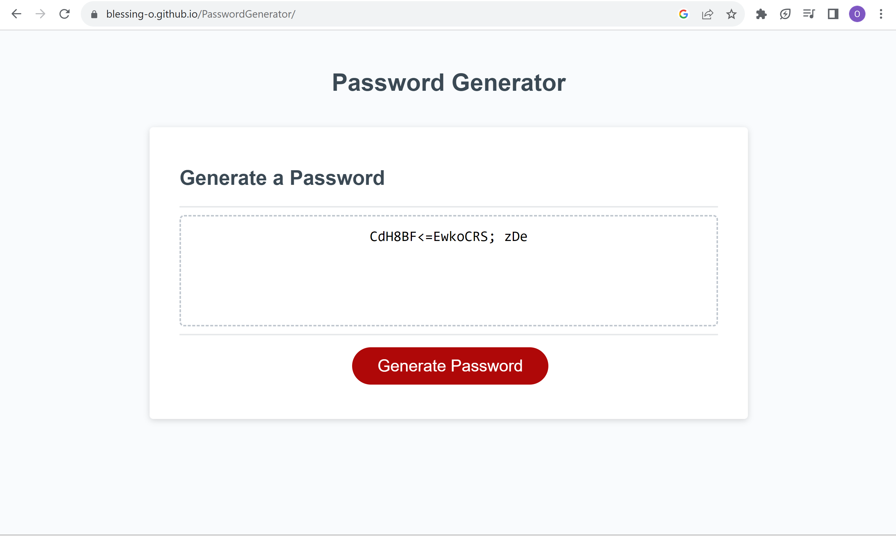

# Password Generator

## Description
Password Generator

This Password Generator project was to asses our understanding of javascript. We are to write a function called generatePassword in the script.js file. This function is to generate a random password that is at least 8 characters long and no more than 128 characters long. The characters allowed in the password will be based on if the user selects they want any of the following: lower case leter, upper case letter, numbers and special characters.

## Installation

N/A

## Screenshot

## Usage

Deployed application link: 
https://blessing-o.github.io/PasswordGenerator/

## Credits

N/A

## License

Please refer to the LICENSE in the repo.